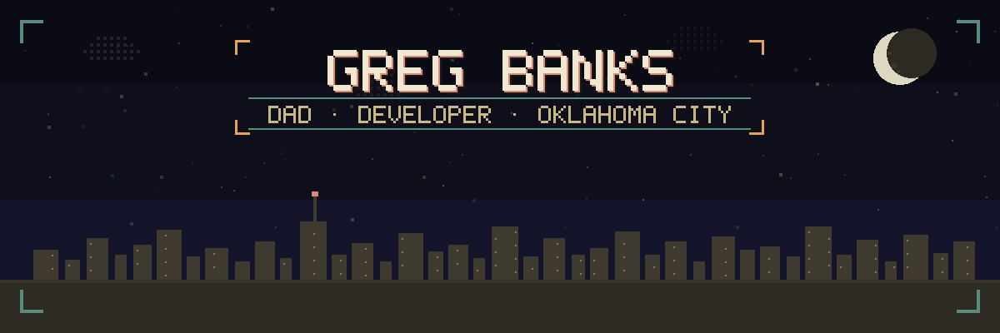
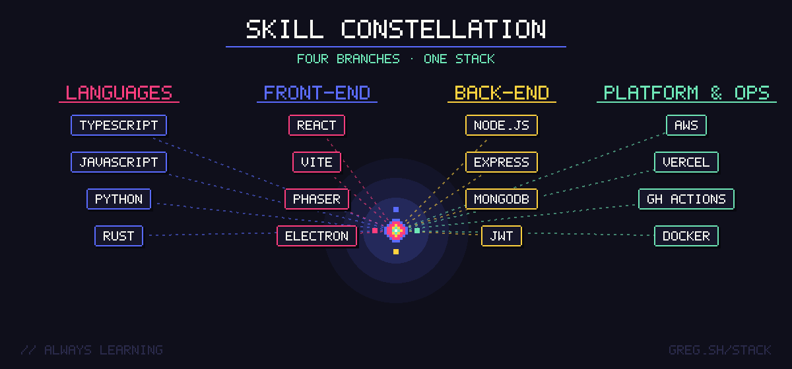
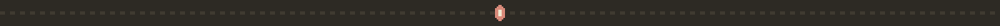
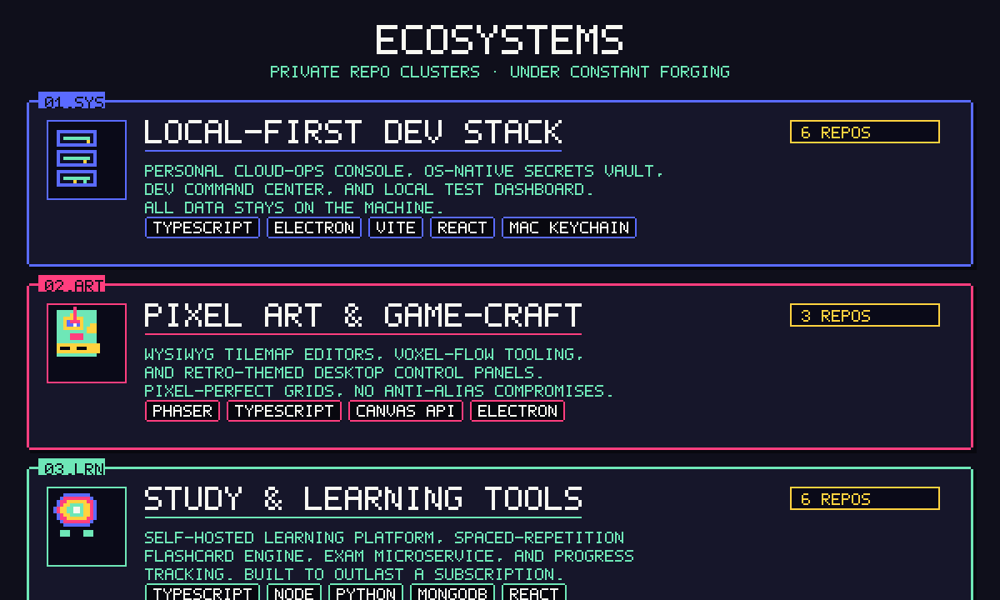
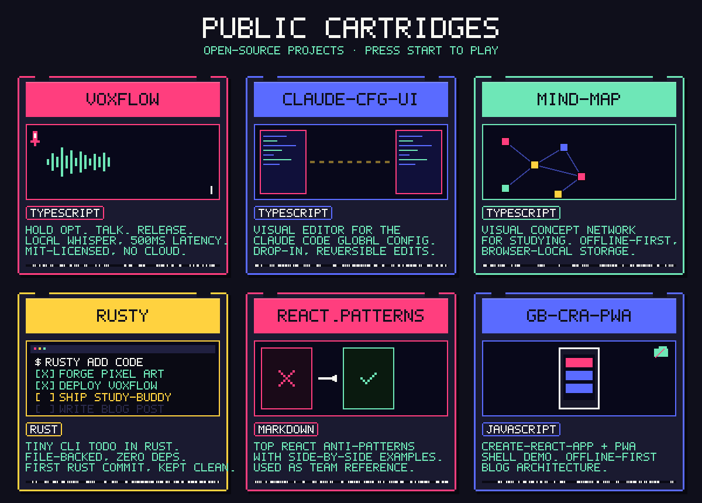
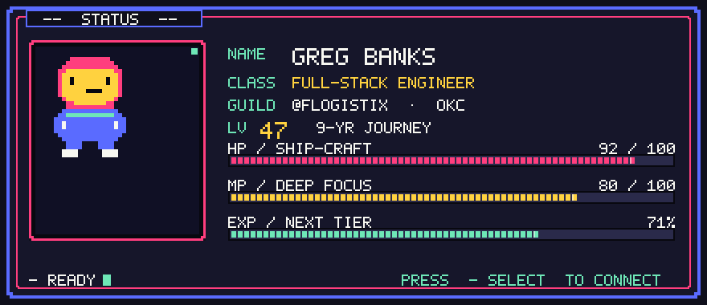

<!--
  README rendered on github.com/gregdbanks. Built from hand-authored SVGs
  in /assets — see /build/*.py for the generator scripts. Palette is locked:
    BG #2D2A24 · INK #F0E8D0 · PRIM #5A8C7C · ACC1 #D88A7A
    ACC2 #C8B987 · WARN #E6A35B
-->

<picture>
  <source media="(prefers-color-scheme: dark)" srcset="https://raw.githubusercontent.com/gregdbanks/gregdbanks/output/github-snake-dark.svg" />
  <source media="(prefers-color-scheme: light)" srcset="https://raw.githubusercontent.com/gregdbanks/gregdbanks/output/github-snake.svg" />
  
</picture>

<h2 align="center">— NOW FORGING —</h2>

<table align="center" border="0" cellpadding="14" cellspacing="0">
  <tr>
    <td valign="top" width="33%" align="left">
      <strong style="color:#D88A7A">▣ TILECRAFT</strong> 
      Phaser-based WYSIWYG tile editor for 16×16 maps. <em>Pixel-perfect grids, no anti-alias compromises.</em>
    </td>
    <td valign="top" width="33%" align="left">
      <strong style="color:#5A8C7C">▣ HATCH + NEST</strong> 
      Personal cloud-ops console paired with an OS-native secrets vault. <em>The day-to-day AWS/Vercel work, off the public consoles.</em>
    </td>
    <td valign="top" width="33%" align="left">
      <strong style="color:#C8B987">▣ STUDY-BUDDY</strong> 
      Self-hosted learning platform with spaced-repetition flashcards, exam microservice, and progress tracking. <em>Built to outlast a subscription.</em>
    </td>
  </tr>
</table>

> **One-liner.** I build and operate production systems — nine years of React, Node, and TypeScript, with a bias toward owning the full path from API design through deploy and observability. I've shipped consumer apps, internal platforms, and developer tooling at scale. _(The retro arcade theme on this page is a personal taste, not a job title.)_

<h3 align="center">— CURRENTLY BUILDING —</h3>

  <em>A learning platform that makes studying feel like a game. 
  My favorite thing to build right now.</em>

  

  <a href="https://study.coffee"><b>StudyBuddy</b></a> 
  Self-hosted spaced-repetition. Built to outlast a subscription.

  

<!--
  Profile readme generators live in /build. To regenerate every asset:
    cd build && python3 banner.py player_card.py skill_tree.py ecosystems.py cartridges.py divider.py footer.py
  Snake graph is regenerated daily by .github/workflows/snake.yml on the
  `output` branch. Stats badges pull live from github-readme-stats.vercel.app.
-->

