<!--
  README rendered on github.com/gregdbanks. Built from hand-authored SVGs
  in /assets — see /build/*.py for the generator scripts. Palette is locked:
    BG #0F0F1B · INK #F8F8F2 · PRIM #5A6BFF · ACC1 #FF3E7E
    ACC2 #6EE7B7 · WARN #FFD23F
-->

  
  
  
  
  
  

> **One-liner.** I build local-first developer tools, retro-themed creative software, and AI-augmented learning systems. Nine years of shipping React, Node, and TypeScript at scale; lately spending evenings carving pixel-art editors and agentic workflows on top of Claude.

<h2 align="center">— ARCADE STATS —</h2>

  
  

  

<h3 align="center">— ISOMETRIC YEAR —</h3>

  

<h3 align="center">— CONTRIBUTION SNAKE —</h3>

<picture>
  <source media="(prefers-color-scheme: dark)" srcset="https://raw.githubusercontent.com/gregdbanks/gregdbanks/output/github-snake-dark.svg" />
  <source media="(prefers-color-scheme: light)" srcset="https://raw.githubusercontent.com/gregdbanks/gregdbanks/output/github-snake.svg" />
  
</picture>

<h2 align="center">— NOW FORGING —</h2>

<table align="center" border="0" cellpadding="14" cellspacing="0">
  <tr>
    <td valign="top" width="33%" align="left">
      <strong style="color:#FF3E7E">▣ TILECRAFT</strong> 
      Phaser-based WYSIWYG tile editor for 16×16 maps. <em>Pixel-perfect grids, no anti-alias compromises.</em>
    </td>
    <td valign="top" width="33%" align="left">
      <strong style="color:#5A6BFF">▣ HATCH + NEST</strong> 
      Personal cloud-ops console paired with an OS-native secrets vault. <em>The day-to-day AWS/Vercel work, off the public consoles.</em>
    </td>
    <td valign="top" width="33%" align="left">
      <strong style="color:#6EE7B7">▣ STUDY-BUDDY</strong> 
      Agentic learning ecosystem with Claude in the loop. <em>Flashcards, notes, exam microservices.</em>
    </td>
  </tr>
</table>

  
  &nbsp;
  
  &nbsp;
  
  &nbsp;
  

  

<!--
  Profile readme generators live in /build. To regenerate every asset:
    cd build && python3 banner.py player_card.py skill_tree.py ecosystems.py cartridges.py divider.py footer.py
  Snake graph is regenerated daily by .github/workflows/snake.yml on the
  `output` branch. Stats badges pull live from github-readme-stats.vercel.app.
-->

